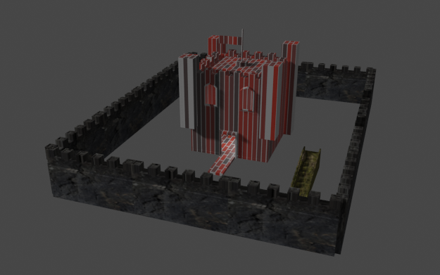
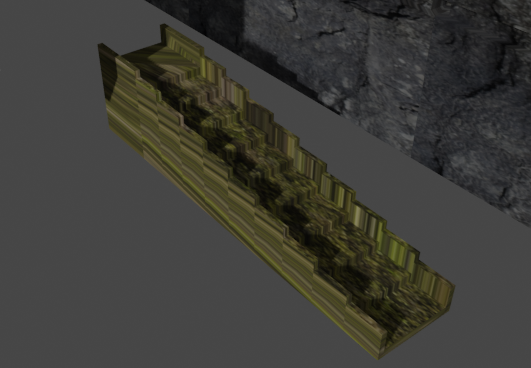
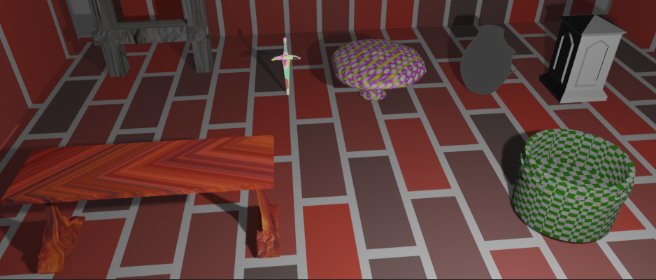

# Castillo y elemento
## Emmanuel Cruz Hernández

----

## Ubicación del proyecto
[https://drive.google.com/drive/folders/1s6neED3hH2cxg4k1ehjEsE8J2xlkTsVf](https://drive.google.com/drive/folders/1s6neED3hH2cxg4k1ehjEsE8J2xlkTsVf)

----

Se presenta el modelo de un castillo básico con 4 muros y una escalera de musgo en el exterior.
Dentro del castillo se presentan 8 modelos de elementos con distintas texturas.

Los elementos están creados con las texturas siguientes:

* Castillo de ladrillo
* Muros de roca.
* Escalones de musgo.
* Mesa de lava
* Escaleras de madera.
* Espada mágica.
* Hongo con radioactivo.
* Jarra de vidrio.
* Lámpara de metal.
* Repisa de madera.
* Cazuela de pintura.

