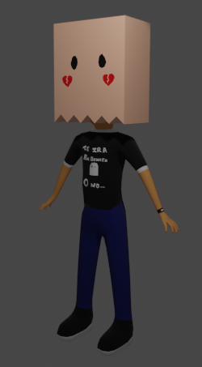

# Modelado y animación de personajes.
## Emmanuel Cruz Hernández Emmanuel.

Para algunos modelos, se itiliza Auto-Ring Pro para facilitar el movimiento y dar más naturalidad al personaje. Todos los movimientos están coordinados con cada uno de los elementos del cuerpo del personaje.
Otros modelos están animados con huesos.

### Personaje con texturas

### Minico

### Batman

### ARP

### Oliver

