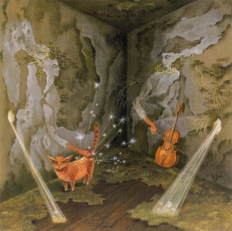
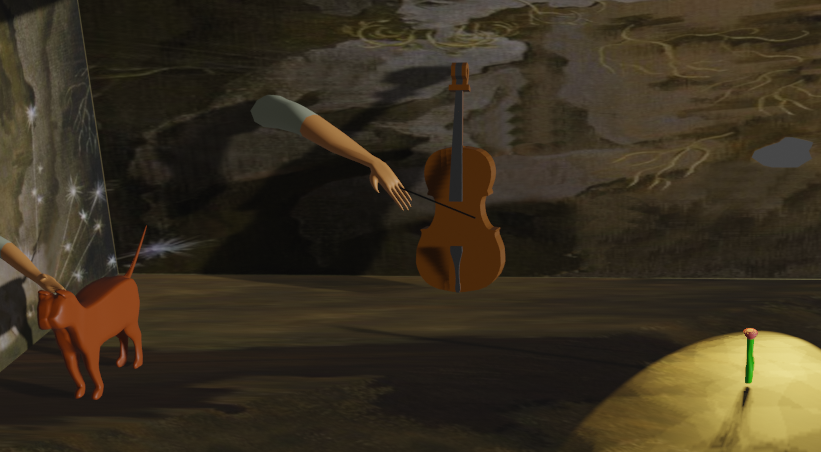
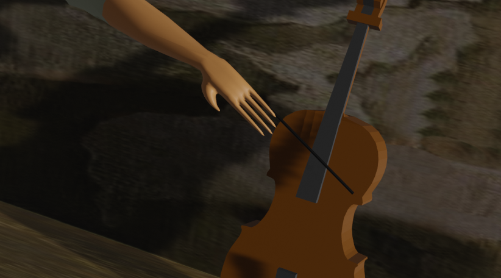
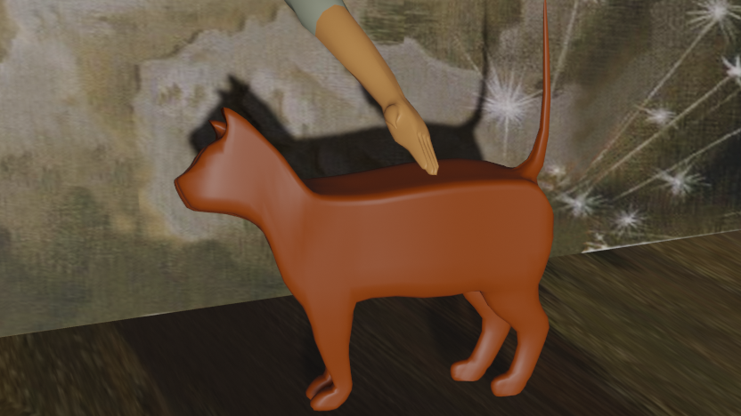
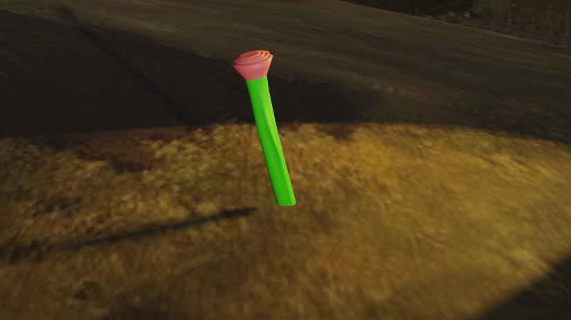

# Pintura de Remedios Varo animada.
## Emmanuel Cruz Hernández.

Representación de la pintura _Energía Cósmica (1956)_ por la pintora surrealista _María de los Remedios Alicia Rodriga Varo y Uranga_ conocida como _Remedios Varo_, animada en un ambiente 3D. 

### Energía Cósmica

### Animación de Energía Cósmica.

[Animación completa](https://drive.google.com/file/d/1MOFOQO8J6pdkNWzHNodwLii1F4yuiuig/view)

